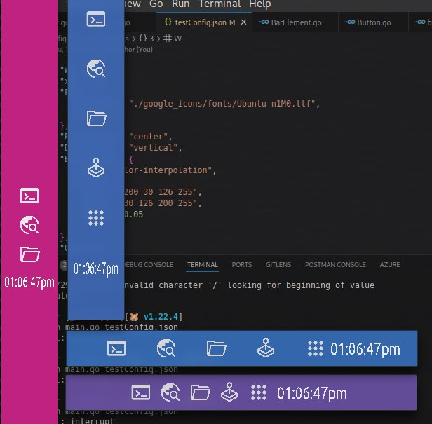

# MAUX-BAR

Simple toolbar written in golang.

Must be configured with a json like

```json
{
  "W": 500,
  "H": 50,
  "Font": {
    "FontPath": "./google_icons/fonts/Ubuntu-n1M0.ttf",
    "Size": 16 
  },
  "PlaceItems": "space-between",
  "Direction":  "horizontal",
  "Background": {
    "Type": "color-interpolation",
    "Values":{
      "col1": "200 30 126 255",
      "col2": "30 126 200 255",
      "delta": 0.05
    }
  },
  "Objects": [
    {
      "ObjType": "button",
      "W": 32,
      "H": 32,
      "Values": {
        "label": "Terminal",
        "imgPath": "./google_icons/term.png",
        "action": ["kitty", "/home/"]
      }
    },
    {
      "ObjType": "button",
      "W": 32,
      "H": 32,
      "Values": {
        "label": "Brave",
        "imgPath": "./google_icons/browser.png",
        "action": ["brave"]
      }
    },
    {
      "ObjType": "button",
      "W": 32,
      "H": 32,
      "Values": {
        "label": "Ranger",
        "imgPath": "./google_icons/folder.png",
        "action": ["kitty", "-e", "ranger"]
      }
    },
    {
      "ObjType": "button",
      "W": 32,
      "H": 32,
      "Values": {
        "label": "Steam",
        "imgPath": "./google_icons/joystick.png",
        "action": ["steam"]
      }
    },
    {
      "ObjType": "button",
      "W": 32,
      "H": 32,
      "Values": {
        "label": "Menu",
        "imgPath": "./google_icons/apps.png",
        "action": ["rofi", "-no-config", "-no-lazy-grab", "-show", "drun", "-modi", "drun"]
      }
    },
    {
      "ObjType": "outputer",
      "W": 100,
      "H": 28,
      "Values": {
        "fontPath": "./google_icons/fonts/Ubuntu-n1M0.ttf",
        "fontSize": 64,
        "fontColor": [255,255,255,255],
        "repetitive": true,
        "action": ["date", "+%I:%M:%S%P"] 
      }
    }
  ]
}

```

To compile 
```bash
go build -o mauxbar
```
To start
```bash
./mauxbar testConfig.json
```

